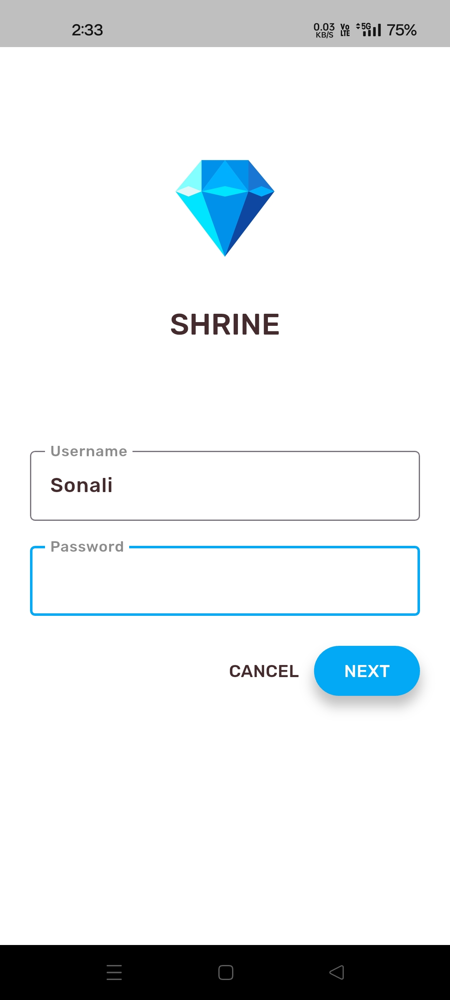
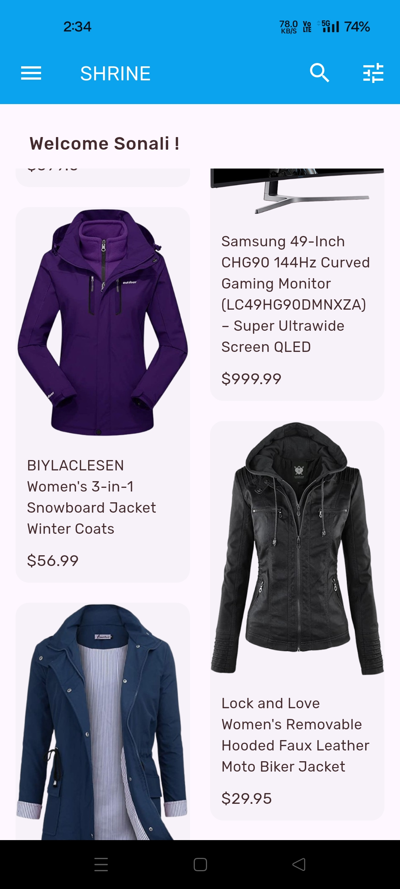
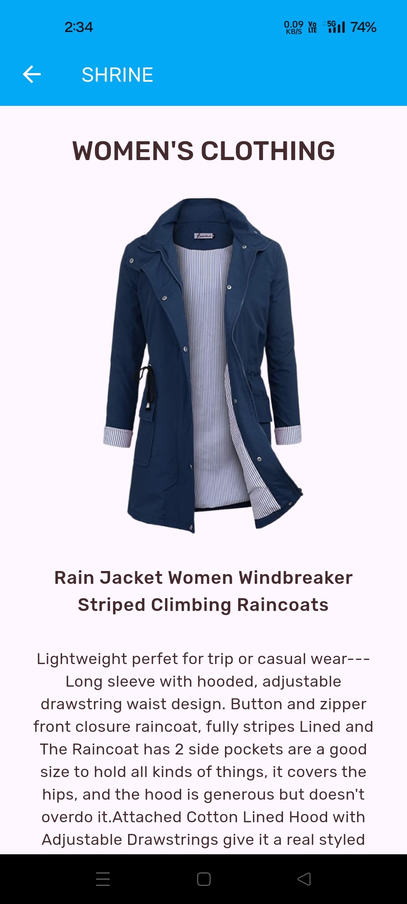

# 📌 Shrine Products

This app was created for learning purpose while doing Google codelabs.

## 📖 Project Overview

This is a shopping cart app,
A new Flutter project created for demo purpose. Includes learnings 
- UI (scafffold, stateful widget, stateless widget, AppBar, Column, Row, etc.)
- Material styling (colors, theme, text)
- Bloc architecture pattern (Bloc, event, state)
- Navigation using Go Router library
- Passing data from one page to another
- API integration using DIO library
- Push notifications using Firebase
- In-app messaging using Firebase

---

## 📱 Screens of the App

The **Shrine** app features a **beautiful and visually appealing UI design**, enhancing the overall user experience. Its having 3 screens... Login screen, Home Screen, Products details screen.

**Login screen:** Basic screen with username and password fields, once pressed **Next** button navigates to Home Screen.   
**Home Screen:** Displays the list of items dynamically. On **Tapping** the card navigates to Products details screen.  
**Products details Screen:** Displays the item details with action buttons.

---

### 🖼️ Screenshots  

  &nbsp;&nbsp;&nbsp;&nbsp;
  &nbsp;&nbsp;&nbsp;&nbsp;
  &nbsp;&nbsp;&nbsp;&nbsp;
 
---

## Getting Started

This project is a starting point for a Flutter application.

A few resources to get you started if this is your first Flutter project:

- [Lab: Write your first Flutter app](https://docs.flutter.dev/get-started/codelab)
- [Cookbook: Useful Flutter samples](https://docs.flutter.dev/cookbook)

For help getting started with Flutter development, view the
[online documentation](https://docs.flutter.dev/), which offers tutorials,
samples, guidance on mobile development, and a full API reference.
